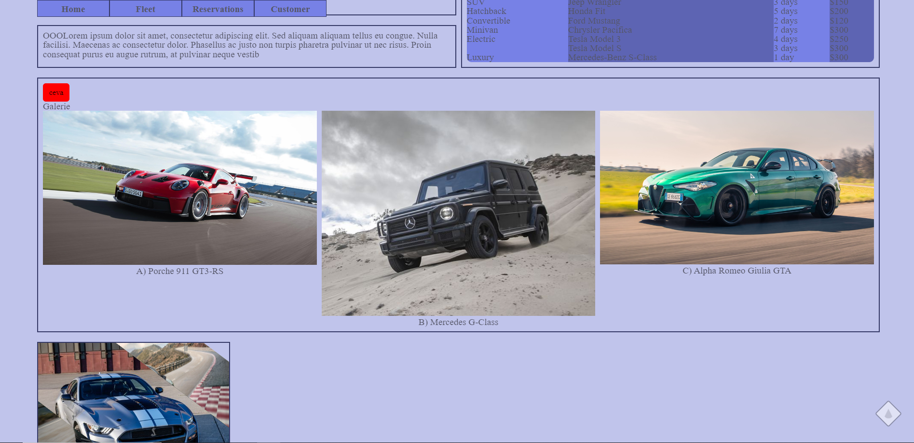

# FleetWheels 🚗

## Descriere 📘
FleetWheels este o platformă de închirieri auto care facilitează gestionarea și rezervarea vehiculelor pentru clienți. Aplicația oferă o interfață prietenoasă și diverse funcționalități pentru a simplifica procesul de căutare și rezervare a mașinilor dorite.

## Funcționalități Principale 🔑
- **Căutare Avansată**: Utilizatorii pot căuta vehicule după nume, putere, preț și tip de combustibil.
- **Filtrare și Sortare**: Filtrare avansată bazată pe atributelor mașinii și sortare după diferite criterii.

## Tehnologii Utilizate 💻
- **Backend**: Node.js cu framework-ul Express
- **Frontend**: HTML, CSS cu Sass, JavaScript cu utilizarea Bootstrap pentru stilizare
- **Baza de Date**: PostgreSQL pentru stocarea datelor

### Descriere Arhitectură Sistem

#### Backend

Backend-ul aplicației FleetWheels este construit folosind **Node.js** și framework-ul **Express**, care gestionează logica de server, interacțiunile cu baza de date și servește paginile web:

*   **index.js**: Acest fișier este punctul de intrare al aplicației. Configurează serverul, rutele și conexiunile cu baza de date. De asemenea, aici sunt definite middleware-urile pentru gestionarea resurselor statice și procesarea cererilor.
    
*   **Client PostgreSQL**: Utilizat pentru gestionarea interacțiunilor cu baza de date PostgreSQL. Execută query-uri pentru a extrage, actualiza sau insera date în baza de date, asigurând funcționalitățile de căutare, filtrare și gestionare a mașinilor.
    
*   **Middleware-uri Express**: Include funcționalități pentru gestionarea erorilor, autentificarea utilizatorilor și servirea fișierelor statice, precum JavaScript, CSS și imagini.
    

#### Frontend

Frontend-ul este construit folosind tehnologii web standard (HTML, CSS) și este prelucrat prin template-uri **EJS**:

*   **Template-uri EJS** (Ex: `fleet.ejs`, `header.ejs`, `footer.ejs`): Aceste fișiere definesc structura și designul paginilor web, fiind rendate de server când un client face o cerere. Includ dinamism în pagini prin inserarea datelor din baza de date direct în HTML.
    
*   **CSS/Sass**: Stilizarea este gestionată prin fișiere CSS generate prin preprocesorul Sass, asigurând un design consistent și responsive al interfeței utilizator.
    
*   **JavaScript/Bootstrap**: Interactivitatea pe partea de client este asigurată prin JavaScript, cu ajutorul Bootstrap pentru componente UI responsive și atractive.
    

#### Baza de Date

*   **PostgreSQL**: Este folosită pentru stocarea tuturor datelor legate de mașini, utilizatori și tranzacții. Schema bazei de date include tabele pentru mașini, utilizatori și alte entități necesare aplicației.

Așadar, FleetWheels este o aplicație de închiriere auto modernă și ușor de utilizat, care oferă atât gestionarilor de flote, cât și clienților o experiență optimizată.
